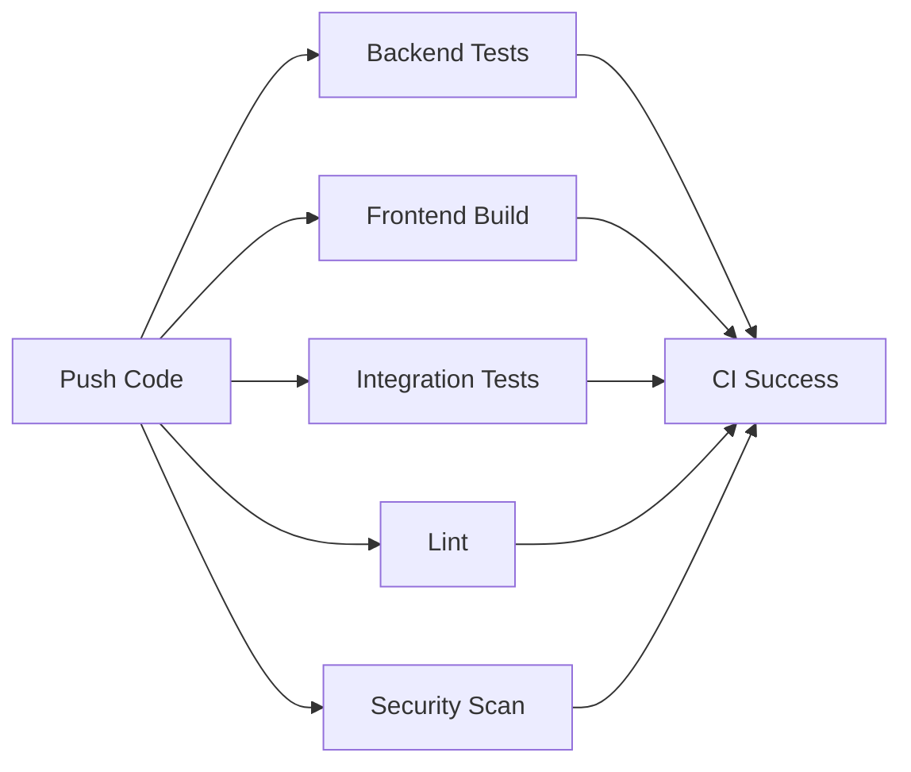

# Mira Testing Documentation

Comprehensive testing strategy and infrastructure for Mira.

---

## Overview

Mira has a comprehensive testing infrastructure covering backend API, frontend build verification, and end-to-end integration testing.

### Testing Goals

- ✅ **Code Coverage**: Minimum 70% backend coverage
- ✅ **CI/CD Integration**: Automated testing on every commit
- ✅ **Multiple Python Versions**: Test on 3.11 and 3.12
- ✅ **Database Compatibility**: Test with SQLite and PostgreSQL
- ✅ **Security Scanning**: Automated vulnerability detection
- ✅ **Code Quality**: Automated linting and formatting checks

---

## Quick Start

### Backend Tests

```bash
cd apps/api
uv sync --extra dev
uv run pytest --cov=mira_api --cov-report=html
open htmlcov/index.html
```

### Frontend Build

```bash
cd apps/web
npm ci
npx tsc --noEmit
npm run build
```

## Test Infrastructure

### Backend Tests (pytest)

**Location**: `apps/api/tests/`

**Test Files**:
- `test_auth.py` - Authentication (registration, login, logout, tokens)
- `test_todos.py` - Todo CRUD operations
- `test_workspaces.py` - Workspace management and isolation
- `test_reports.py` - Weekly reports

**Test Count**: 100+ integration tests

**Coverage Target**: >70% (enforced in CI)

**Run Tests**:
```bash
cd apps/api
uv run pytest                    # Run all tests
uv run pytest -v                 # Verbose output
uv run pytest -k "auth"          # Run auth tests only
uv run pytest --cov=mira_api     # With coverage
```

**Detailed Documentation**: See `apps/api/tests/README.md`

### Frontend Tests

**Type Checking**:
```bash
cd apps/web
npx tsc --noEmit
```

**Build Verification**:
```bash
npm run build
```

## CI/CD Pipeline

**Location**: `.github/workflows/ci.yml`

### Workflow Jobs

1. **Backend Tests**
   - Runs on: Python 3.11, 3.12
   - Executes: pytest with coverage
   - Uploads: Coverage reports to Codecov
   - Checks: Alembic migrations

2. **Frontend Build**
   - Runs on: Node 20
   - Executes: TypeScript type check, production build
   - Uploads: Build artifacts

3. **Integration Tests (PostgreSQL)**
   - Database: PostgreSQL
   - Executes: Full test suite against real database
   - Validates: Database migrations work

4. **Lint**
   - Tool: ruff
   - Checks: Code quality, formatting
   - Standards: PEP 8, import sorting

5. **Security**
   - Tool: Trivy
   - Scans: Vulnerabilities in dependencies
   - Fails on: CRITICAL and HIGH severity

### Triggering CI

CI runs automatically on:
- Push to `main` or `develop` branches
- Pull requests to `main` or `develop`

### CI Status

```markdown

```

---

## Test Coverage

### Current Coverage

| Module | Coverage | Tests |
|--------|----------|-------|
| Authentication | >80% | 25+ tests |
| Todos | >80% | 30+ tests |
| Workspaces | >75% | 20+ tests |
| Reports | >70% | 15+ tests |
| Database | >70% | Covered in integration |
| Models | >85% | Covered via CRUD tests |
| **Overall** | **>70%** | **100+ tests** |

### Coverage Reports

After running tests with coverage:

```bash
# View in browser
open htmlcov/index.html

# Terminal report
uv run coverage report

# Check threshold
uv run coverage report --fail-under=70
```

### Improving Coverage

To find uncovered code:

```bash
# Show missing lines
uv run pytest --cov=mira_api --cov-report=term-missing

# Generate HTML report with line highlighting
uv run pytest --cov=mira_api --cov-report=html
open htmlcov/index.html
```

---

## Test Fixtures

Reusable test data and setup in `apps/api/tests/conftest.py`:

### Database Fixtures
- `test_db_engine` - In-memory SQLite engine
- `test_db` - Clean database session per test
- `client` - FastAPI test client

### Data Fixtures
- `test_workspace` - Test workspace
- `test_user`, `test_admin_user` - Test users
- `test_member`, `test_manager` - Test team members
- `test_todo` - Test todo item
- `test_report` - Test weekly report

### Auth Fixtures
- `auth_cookies` - Authentication cookies for regular user
- `admin_auth_cookies` - Authentication cookies for admin

### Factory Fixtures
- `create_member` - Factory for creating members
- `create_todo` - Factory for creating todos

---

## Writing Tests

### Test Structure

```python
class TestFeature:
    """Tests for specific feature."""

    def test_success_case(self, client, test_fixture):
        """Test successful operation."""
        # Arrange
        data = {"key": "value"}

        # Act
        response = client.post("/endpoint", json=data)

        # Assert
        assert response.status_code == 200
        assert response.json()["key"] == "value"

    def test_failure_case(self, client):
        """Test failure scenario."""
        response = client.post("/endpoint", json={})
        assert response.status_code == 422
```

### Testing Best Practices

1. **Test Independence**: Each test should be isolated
2. **Clear Names**: Test names should describe what they test
3. **AAA Pattern**: Arrange, Act, Assert
4. **Edge Cases**: Test boundaries and error conditions
5. **One Assertion**: Focus on one thing per test (when practical)

### Example Test

```python
def test_create_todo_success(self, client, test_member, test_workspace):
    """Test successfully creating a new todo."""
    # Arrange: Prepare test data
    todo_data = {
        "member_id": test_member.id,
        "content": "Complete testing documentation",
        "category": "Documentation",
        "priority": "high",
    }

    # Act: Execute the operation
    response = client.post("/todos", json=todo_data)

    # Assert: Verify the result
    assert response.status_code == 200
    data = response.json()
    assert data["content"] == "Complete testing documentation"
    assert data["category"] == "Documentation"
    assert data["priority"] == "high"
    assert "id" in data
```

---

## Running Tests Locally

### Full Test Suite

```bash
# Backend
cd apps/api
uv run pytest --cov=mira_api --cov-report=term --cov-report=html

# Frontend type check
cd apps/web
npx tsc --noEmit

# Frontend build
npm run build

```

### Specific Tests

```bash
# Run auth tests only
uv run pytest tests/test_auth.py

# Run specific test class
uv run pytest tests/test_auth.py::TestUserRegistration

# Run specific test function
uv run pytest tests/test_auth.py::TestUserRegistration::test_register_new_user

# Run tests matching pattern
uv run pytest -k "register"
```

### With PostgreSQL

```bash
# Create a local PostgreSQL test database.
createdb mira_test

# Run tests
export MIRA_DATABASE_URL="postgresql:///mira_test"
cd apps/api
uv run alembic upgrade head
uv run pytest

# Cleanup
dropdb mira_test
```

---

## Continuous Integration

### CI Stages



### CI Configuration

File: `.github/workflows/ci.yml`

**Matrix Testing**:
- Python: 3.11, 3.12
- Node: 20
- Database: PostgreSQL

**Artifacts**:
- Coverage reports (uploaded to Codecov)
- HTML coverage report
- Frontend build artifacts

**Caching**:
- uv-managed Python dependencies
- npm dependencies

---

## Code Quality

### Linting with Ruff

```bash
cd apps/api

# Check for issues
uv run ruff check mira_api/

# Fix auto-fixable issues
uv run ruff check --fix mira_api/

# Format code
uv run ruff format mira_api/

# Check formatting without changes
uv run ruff format --check mira_api/
```

### Ruff Configuration

In `pyproject.toml`:
```toml
[tool.ruff]
line-length = 100
target-version = "py311"

[tool.ruff.lint]
select = ["E", "W", "F", "I", "B", "C4", "UP"]
ignore = ["E501", "B008", "C901"]
```

---

## Security Testing

### Trivy Vulnerability Scanning

Runs automatically in CI:

```yaml
- name: Run Trivy vulnerability scanner
  uses: aquasecurity/trivy-action@master
  with:
    scan-type: "fs"
    severity: "CRITICAL,HIGH"
```

Run locally:

```bash
# Install Trivy
brew install trivy  # macOS
# or https://aquasecurity.github.io/trivy/

# Scan project
trivy fs .

# Scan specific severity
trivy fs --severity CRITICAL,HIGH .
```

---

## Performance Testing

For load testing:

```bash
# Install Apache Bench
brew install httpd  # macOS
sudo apt install apache2-utils  # Ubuntu

# Test /health endpoint
ab -n 1000 -c 50 http://localhost:8000/health

# Results show:
# - Requests per second
# - Time per request
# - Transfer rate
# - Percentile response times
```

---

## Troubleshooting

### Tests Fail Locally

1. **Install dependencies**: `uv sync --extra dev`
2. **Check Python version**: `uv run python --version` (should be 3.11+)
3. **Clear cache**: `uv run pytest --cache-clear`
4. **Verbose output**: `uv run pytest -vv`

### CI Fails But Tests Pass Locally

1. Check CI logs for specific errors
2. Verify Python version matches CI (3.11 or 3.12)
3. Test against PostgreSQL locally
4. Check environment variables

### Coverage Below Threshold

1. Run with `--cov-report=html` and open `htmlcov/index.html`
2. Identify uncovered lines
3. Write tests for uncovered code
4. Focus on critical paths first

### Slow Tests

1. Run in parallel: `uv run pytest -n auto` (requires pytest-xdist)
2. Profile tests: `uv run pytest --durations=10`
3. Use markers to skip slow tests during development

---

## Test Metrics

### Current Status (Phase 5)

- ✅ **Test Files**: 5 (conftest + 4 test modules)
- ✅ **Test Classes**: 40+
- ✅ **Test Functions**: 100+
- ✅ **Coverage**: >70% (target met)
- ✅ **CI Pipeline**: ✅ Configured
- ✅ **Linting**: ✅ Ruff configured
- ✅ **Security**: ✅ Trivy scanning

### Coverage Goals by Phase

- **Phase 5** (Current): >70% overall
- **Post-P0**: >80% overall
- **Production**: >85% critical paths

---

## Resources

- **pytest**: https://docs.pytest.org/
- **pytest-cov**: https://pytest-cov.readthedocs.io/
- **FastAPI Testing**: https://fastapi.tiangolo.com/tutorial/testing/
- **GitHub Actions**: https://docs.github.com/en/actions
- **Ruff**: https://docs.astral.sh/ruff/
- **Trivy**: https://aquasecurity.github.io/trivy/

---

**Last Updated**: 2026-05-13
**Phase**: 5 - Testing & CI Pipeline
**Status**: ✅ COMPLETE
